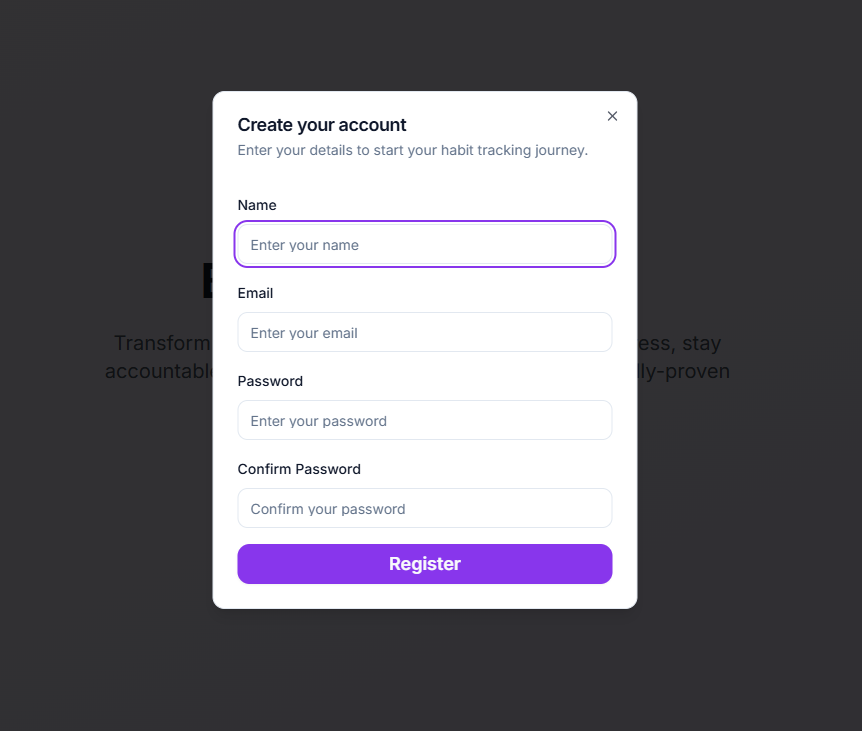
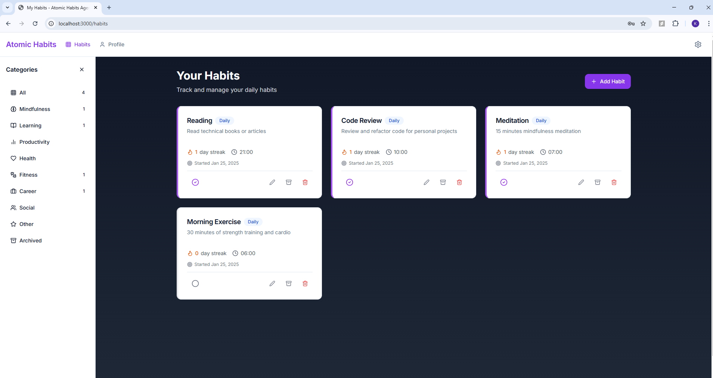
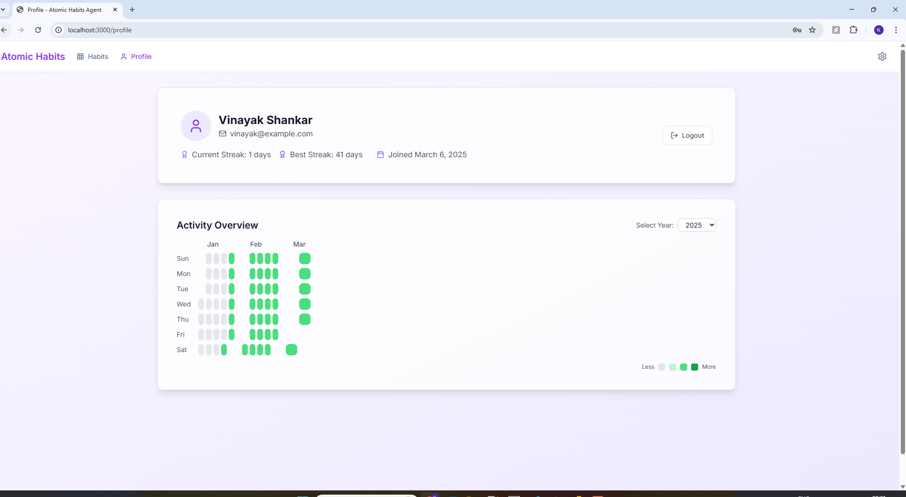

# Atomic Habits Agent

A comprehensive habit tracking and building application inspired by James Clear's "Atomic Habits" book. This project helps users track, build, and maintain positive habits through consistent monitoring and intelligent feedback.

## Overview

Atomic Habits Agent is a full-stack web application designed to help users build better habits through consistent tracking and monitoring. The application implements the core principles from the best-selling book "Atomic Habits," focusing on making habit formation measurable, visible, and rewarding. Users can track their daily habits, monitor their progress, and receive insights on their habit formation journey.

## Screenshots







## Key Features

- **User Authentication**: Secure signup, login, and profile management with JWT
- **Habit Management**: Create, update, delete, and track habits with rich details
- **Categorization**: Organize habits by category (Health, Learning, Productivity, etc.)
- **Frequency Settings**: Set habits as daily, weekly, or monthly with specific times
- **Smart Streak Tracking**: Intelligent tracking of consecutive completions with automatic resets
- **Archive System**: Archive completed or paused habits without losing data
- **Progress Visualization**: Visual representation of habit formation progress
- **Responsive Design**: Fully responsive UI that works seamlessly on desktop and mobile devices
- **Dark Mode Support**: Toggle between light and dark themes based on preference
- **Personalized Recommendations**: Coming soon via RAG pipeline integration

## Tech Stack

### Frontend
- **Framework**: Next.js 14 with App Router
- **Language**: TypeScript
- **State Management**: React's built-in hooks (useState, useEffect)
- **Form Handling**: React Hook Form with validation
- **Styling**: Tailwind CSS with custom components
- **UI Components**: Custom components with Radix UI primitives
- **Authentication**: JWT token management

### Backend
- **Framework**: FastAPI
- **Language**: Python 3.10+
- **Database**: SQLAlchemy ORM with SQLite
- **Authentication**: JWT with bcrypt password hashing
- **API Documentation**: Swagger UI and ReDoc
- **Security**: CORS protection, password hashing, and secure token handling

## Architecture

The application follows a clean client-server architecture:

### Frontend Architecture
- Modern component-based structure with clear separation of concerns
- Service layer pattern for API communication
- Responsive UI with mobile-first approach
- Form validation with React Hook Form
- Strong typing with TypeScript throughout

### Backend Architecture
- RESTful API design with FastAPI
- Repository pattern with SQLAlchemy ORM
- JWT authentication with secure practices
- Clear separation between routes, models, and schemas
- Automatic habit reset mechanism based on frequency

## RAG Pipeline Roadmap

### Retrieval-Augmented Generation (RAG) for Habit Recommendations

The following tasks outline the implementation of a RAG pipeline to provide personalized habit recommendations:

1. **Data Collection and Processing**
   - [ ] Extract habit-related content from "Atomic Habits" book and related resources
   - [ ] Process and chunk text data for effective retrieval
   - [ ] Create embeddings for semantic search

2. **Vector Database Setup**
   - [ ] Set up a vector database (e.g., Pinecone, Weaviate, or FAISS)
   - [ ] Store and index document embeddings
   - [ ] Implement efficient retrieval mechanisms

3. **LLM Integration**
   - [ ] Set up connection to an LLM API (e.g., OpenAI, Anthropic)
   - [ ] Create prompt templates for habit recommendations
   - [ ] Develop context integration mechanisms

4. **Recommendation Engine**
   - [ ] Design recommendation algorithm based on user habit data
   - [ ] Implement personalization based on user progress and preferences
   - [ ] Create feedback mechanisms to improve recommendations

5. **API Integration**
   - [ ] Develop backend endpoints for recommendation requests
   - [ ] Implement caching mechanisms for frequent queries
   - [ ] Add authentication for secure access to the recommendation service

6. **UI Components**
   - [ ] Design recommendation display components
   - [ ] Create feedback UI for recommendation quality
   - [ ] Integrate with existing habit tracking interface

7. **Testing and Evaluation**
   - [ ] Implement evaluation metrics for recommendation quality
   - [ ] Set up A/B testing framework
   - [ ] Create user feedback collection mechanisms

## Project Structure

```
atomic-habits-agent/
├── backend/                  # Python FastAPI backend
│   ├── app/
│   │   ├── api/              # API routes and controllers
│   │   │   └── routes/       # Endpoint handlers
│   │   ├── core/             # Core functionality and config
│   │   ├── db/               # Database setup and sessions
│   │   ├── models/           # SQLAlchemy ORM models
│   │   └── schemas/          # Pydantic validation schemas
│   ├── main.py               # Application entry point
│   └── requirements.txt      # Python dependencies
│
├── frontend/                 # Next.js frontend
│   ├── src/
│   │   ├── app/              # Next.js pages and layouts
│   │   │   ├── habits/       # Habit management pages
│   │   │   ├── login/        # Authentication pages
│   │   │   └── profile/      # User profile pages
│   │   ├── components/       # React components
│   │   │   ├── auth/         # Authentication components
│   │   │   ├── habits/       # Habit tracking components
│   │   │   ├── layout/       # Layout components
│   │   │   ├── providers/    # Context providers
│   │   │   └── ui/           # UI components
│   │   └── lib/              # Utilities and services
│   │       ├── services/     # API service functions
│   │       └── types/        # TypeScript type definitions
│   ├── package.json          # Node dependencies
│   └── next.config.js        # Next.js configuration
│
└── README.md                 # This file
```

## Installation

### Prerequisites

- Node.js (v18+)
- Python (v3.10+)
- Git

### Setup

1. Clone the repository
   ```bash
   git clone https://github.com/your-username/atomic-habits-agent.git
   cd atomic-habits-agent
   ```

2. Setup the backend
   ```bash
   cd backend
   python -m venv .venv
   # On Windows
   .\.venv\Scripts\activate
   # On macOS/Linux
   source .venv/bin/activate
   pip install -r requirements.txt
   ```

3. Setup the frontend
   ```bash
   cd frontend
   npm install
   ```

## Usage

### Running the backend

```bash
cd backend
# Activate the virtual environment if not already activated
python main.py
```

The API will be available at http://localhost:8000
API documentation is available at:
- Swagger UI: http://localhost:8000/docs
- ReDoc: http://localhost:8000/redoc

### Running the frontend

```bash
cd frontend
npm run dev
```

The application will be available at http://localhost:3000.

## Future Enhancements

- **Analytics Dashboard**: Detailed insights into habit performance over time
- **Mobile App**: Native mobile applications for iOS and Android
- **Social Features**: Share progress and compete with friends
- **Integration with Wearables**: Connect with fitness trackers and smartwatches
- **Reminder System**: Push notifications and email reminders
- **Habit Templates**: Pre-configured habit templates based on common goals

## Contributing

Contributions are welcome! Please feel free to submit a Pull Request.

## License

This project is licensed under the MIT License - see the LICENSE file for details.

## Acknowledgements

- James Clear for the "Atomic Habits" book that inspired this project
- The FastAPI and Next.js communities for their excellent documentation
