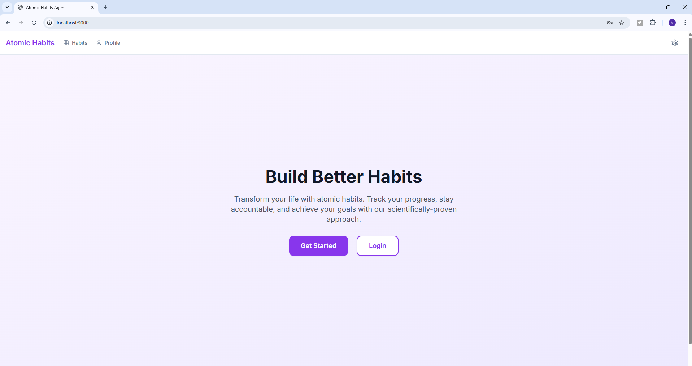
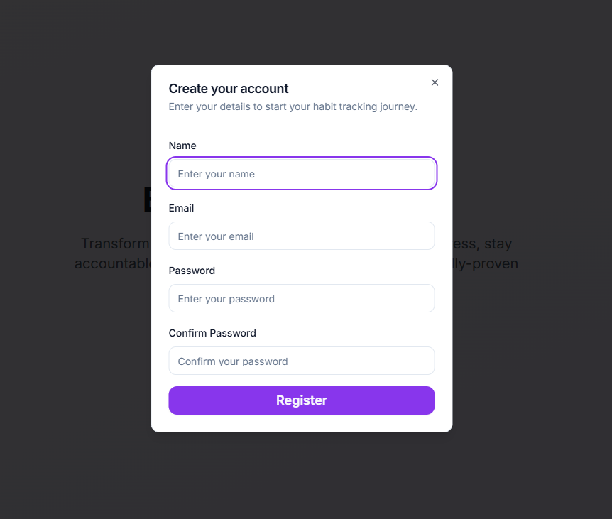
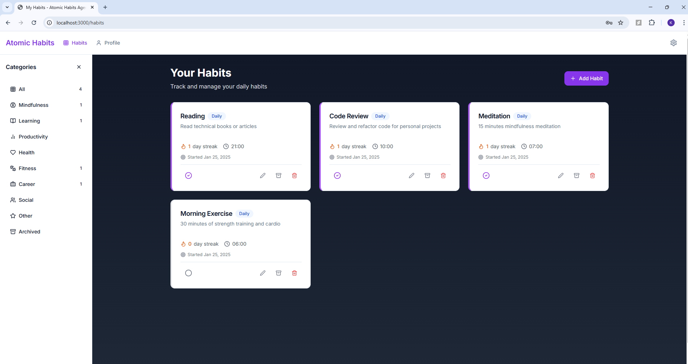
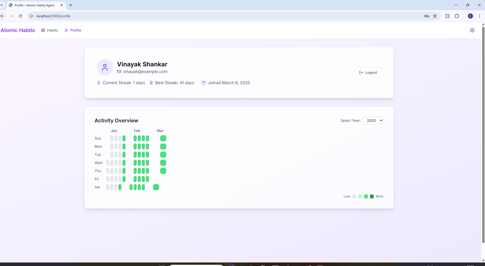

# Atomic Habits Agent

A comprehensive habit tracking and building application inspired by James Clear's "Atomic Habits" book. This project helps users track, build, and maintain positive habits through consistent monitoring and feedback.

## Overview

Atomic Habits Agent is a full-stack web application designed to help users build better habits through consistent tracking and monitoring. The application allows users to track their daily habits, monitor their progress, and receive insights on their habit formation journey.

## Key Features

- **User Authentication**: Secure signup, login, and user management
- **Habit Management**: Create, update, delete, and track habits
- **Progress Tracking**: Visual representation of habit formation progress
- **Streak Monitoring**: Track consecutive days of habit completion
- **Responsive Design**: Works on desktop and mobile devices
- **Data-Driven Insights**: Analytics to help users understand their habit patterns
- **Personalized Recommendations**: Coming soon via RAG pipeline integration







## Tech Stack

### Frontend
- **Framework**: Next.js 14
- **Language**: TypeScript
- **Styling**: Tailwind CSS
- **UI Components**: Custom components with Radix UI primitives

### Backend
- **Framework**: FastAPI
- **Language**: Python
- **Database**: SQLAlchemy with SQLite
- **Authentication**: JWT with python-jose

## RAG Pipeline Todo List

### Retrieval-Augmented Generation (RAG) for Habit Recommendations

The following tasks outline the implementation of a RAG pipeline to provide personalized habit recommendations:

1. **Data Collection and Processing**
   - [ ] Extract habit-related content from "Atomic Habits" book and related resources
   - [ ] Process and chunk text data for effective retrieval
   - [ ] Create embeddings for semantic search

2. **Vector Database Setup**
   - [ ] Set up a vector database (e.g., Pinecone, Weaviate, or FAISS)
   - [ ] Store and index document embeddings
   - [ ] Implement efficient retrieval mechanisms

3. **LLM Integration**
   - [ ] Set up connection to an LLM API (e.g., OpenAI, Anthropic)
   - [ ] Create prompt templates for habit recommendations
   - [ ] Develop context integration mechanisms

4. **Recommendation Engine**
   - [ ] Design recommendation algorithm based on user habit data
   - [ ] Implement personalization based on user progress and preferences
   - [ ] Create feedback mechanisms to improve recommendations

5. **API Integration**
   - [ ] Develop backend endpoints for recommendation requests
   - [ ] Implement caching mechanisms for frequent queries
   - [ ] Add authentication for secure access to the recommendation service

6. **UI Components**
   - [ ] Design recommendation display components
   - [ ] Create feedback UI for recommendation quality
   - [ ] Integrate with existing habit tracking interface

7. **Testing and Evaluation**
   - [ ] Implement evaluation metrics for recommendation quality
   - [ ] Set up A/B testing framework
   - [ ] Create user feedback collection mechanisms

## Project Structure

```
atomic-habits-agent/
├── backend/             # Python FastAPI backend
│   ├── app/
│   │   ├── api/         # API routes and controllers
│   │   ├── core/        # Configuration and startup
│   │   ├── db/          # Database models and session
│   │   ├── models/      # SQLAlchemy models
│   │   └── schemas/     # Pydantic schemas
│   ├── main.py          # Application entry point
│   └── requirements.txt # Python dependencies
├── frontend/            # Next.js frontend
│   ├── src/
│   │   ├── app/         # Next.js pages and layouts
│   │   ├── components/  # React components
│   │   ├── lib/         # Utility functions
│   │   └── services/    # API service functions
│   ├── package.json     # Node dependencies
│   └── next.config.js   # Next.js configuration
└── README.md            # This file
```

## Installation

### Prerequisites

- Node.js (v18+)
- Python (v3.10+)
- Git

### Setup

1. Clone the repository
   ```bash
   git clone https://github.com/your-username/atomic-habits-agent.git
   cd atomic-habits-agent
   ```

2. Setup the backend
   ```bash
   cd backend
   python -m venv .venv
   # On Windows
   .\.venv\Scripts\activate
   # On macOS/Linux
   source .venv/bin/activate
   pip install -r requirements.txt
   ```

3. Setup the frontend
   ```bash
   cd frontend
   npm install
   ```

## Usage

### Running the backend

```bash
cd backend
# Activate the virtual environment if not already activated
python main.py
```

The API will be available at http://localhost:8000

### Running the frontend

```bash
cd frontend
npm run dev
```

The application will be available at http://localhost:3000.
